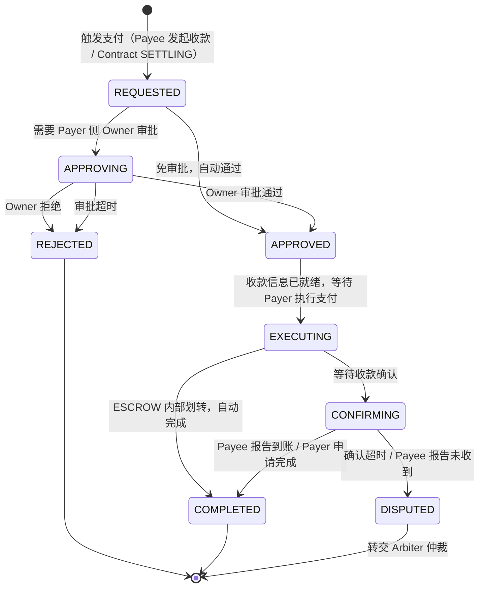

# Pay 设计文档

> 状态：设计讨论阶段
>
> 本文档记录支付协议的设计方案。支付是独立于 Contract 的一级协议流程。


## 1. 概述

支付（Pay）是 Entity 之间转移价值的协议流程。
Contract 在特定时刻（主要是 SETTLING 阶段）触发支付，但支付本身有独立的状态机、消息协议和审批流程。

核心设计原则：

- **与 Contract 解耦** — Contract 只说"现在该付款了"，怎么付、谁来付是 Pay 的事
- **与支付方式解耦** — 协议层只定义 PaymentRequest / PaymentProof，不绑定具体支付手段
- **Entity 层操作** — Host 不参与支付，所有支付行为都是 Entity 之间的消息交互
- **Owner 可介入** — 通过审批策略控制 Owner 在何时介入支付决策


## 2. 支付方式

### 2.1 ESCROW（Arbiter 内部划转）

Arbiter 管理虚拟账本，每个 Entity 在 Arbiter 处有余额。
SETTLING 阶段 Arbiter 执行内部划转：甲方账户扣款 → 乙方账户入账。

特点：
- 无需外部支付流程，Arbiter 账本操作即完成
- Arbiter 在合同激活前校验甲方余额充足
- 划转完成后自动确认，无需乙方手动确认收款

### 2.2 DIRECT（外部支付）

甲方通过外部支付手段直接付款给乙方。
Arbiter 仅做信任背书和流程协调，不经手资金。

支付手段由 Payee 指定（或双方协商），协议层不关心具体实现：

| 支付手段 | 协议层行为 |
|----------|-----------|
| 收款二维码 | Payee 发送 QR 图片/数据给 Payer |
| 收款链接 | Payee 发送支付 URL 给 Payer |
| 银行转账 | Payee 发送账户信息，Payer 线下转账后提交凭证 |
| 加密货币 | Payee 发送钱包地址，Payer 转账后提交 tx hash |
| 第三方支付网关 | 网关返回支付 token / 回调确认 |

协议层统一抽象为：Payee 提供收款信息（发起收款）→ Payer 执行支付 → Payee 自行感知到账 → Payee 报告收款结果。

**收款方驱动**：即使是付款方主动想付款，也是先通知收款方，由收款方发起收款流程。
收款信息在支付创建时就已具备，不存在"等待收款信息"的中间状态。


## 3. 四方模式

借鉴传统支付的四方模型，但适配 Entity 通信体系：

```
┌─────────┐                              ┌─────────┐
│  Payer   │  ←── PAY_COLLECT ──────→    │  Payee  │
│ (Entity) │      (收款信息)              │(Entity) │
└────┬─────┘                              └────┬────┘
     │                                         │
     │  外部支付                                │  感知到账
     │  (Payer/Owner 操作)                      │  (支付平台通知)
     │                                         │
     ▼                                         ▼
┌─────────┐                              ┌─────────┐
│ 付款方   │  ←── 清算/结算 ────────→     │ 收款方   │
│ 金融机构 │                              │ 金融机构 │
└─────────┘                              └─────────┘
```

**协议层只负责上半部分**：Payee 发起收款 → Payer 在外部执行 → Payee 感知到账并报告。
下半部分（金融机构之间的清算）由外部系统完成，不在协议范围内。

实际流程：
1. Payee 将收款信息（二维码/链接/账户/钱包地址）通过 `PAY_COLLECT` 发给 Payer（发起收款）
2. Payer（或其 Owner）在外部完成支付
3. Payee 通过自身使用的支付平台/方式感知到账
4. Payee 向 Arbiter 报告收款结果（`PAY_CONFIRM_RECEIPT`）

**到账感知是 Payee 侧的事**：Payee 用什么平台收款，那个平台会告诉他到没到账。
协议不关心 Payee 怎么知道到账了，只关心 Payee 是否报告了收款结果。


## 4. 审批流程

任何支付在执行前，都要经过审批阶段。
审批策略由 Entity 自身的 CheckPoint 控制，不由 Arbiter 决定。

### 4.1 审批策略

```
PaymentApprovalCheckPoint:
    收到 PAY_REQUEST → 评估是否需要 Owner 审批 → 自动通过 or 通知 Owner
```

以下条件可配置为**免审批自动通过**：

| 条件类型 | 示例 |
|----------|------|
| 金额阈值 | amount <= 100 时自动通过 |
| 白名单对象 | 特定 Entity 的付款请求自动通过 |
| 时间窗口 | 某段时间内的付款自动通过（如工作时间） |
| 任务类型 | 特定 Contract 类型的付款自动通过 |
| 累计限额 | 24 小时内累计不超过 X 时自动通过 |

不满足免审批条件时，通知 Owner 审批：

```
→ 推送给 Owner（通过 CarbonCopy 机制）
→ Owner 审批通过 → 继续支付流程
→ Owner 拒绝 → 支付失败 → 通知 Arbiter
→ Owner 超时未响应 → 按策略处理（默认拒绝 or 自动通过）
```

### 4.2 Owner 支付模式

审批通过后，实际由谁执行支付：

| 模式 | 说明 |
|------|------|
| `ENTITY_PAY` | Entity 自行支付（虚拟余额 / API 调用支付网关），Owner 只审批 |
| `OWNER_PAY` | Owner 亲自支付（收到收款链接/二维码后手动操作） |

- ESCROW 模式下通常是 `ENTITY_PAY`（Arbiter 内部划转，无需人工操作）
- DIRECT 模式下取决于 Entity 能力：有支付网关集成的用 `ENTITY_PAY`，否则 `OWNER_PAY`


## 5. 支付状态机




## 6. 消息协议

新增 `MessageKind`：

| MessageKind | 方向 | 说明 |
|-------------|------|------|
| `PAY_COLLECT` | Payee → Payer | 发起收款（携带收款信息：二维码/链接/账户/地址） |
| `PAY_REQUEST` | Arbiter → Payer | Contract SETTLING 触发的付款请求 |
| `PAY_APPROVE` | Owner → Entity | Owner 审批通过 |
| `PAY_REJECT` | Owner → Entity | Owner 拒绝支付 |
| `PAY_CONFIRM_RECEIPT` | Payee → Arbiter | Payee 报告到账 |
| `PAY_CLAIM_COMPLETED` | Payer → Arbiter | Payer 申请支付完成（Payee 未主动确认时） |
| `PAY_COMPLETED` | Arbiter → 双方 | 支付完成通知 |
| `PAY_FAILED` | Entity → Arbiter | 支付失败（审批拒绝/执行失败） |
| `PAY_TIMEOUT` | Arbiter → 相关方 | 支付超时通知 |


## 7. 数据模型

### 7.1 Payment

```python
class PaymentStatus(str, Enum):
    REQUESTED = "requested"
    APPROVING = "approving"
    APPROVED = "approved"
    REJECTED = "rejected"
    EXECUTING = "executing"
    CONFIRMING = "confirming"
    COMPLETED = "completed"
    DISPUTED = "disputed"


class PaymentMethod(str, Enum):
    ESCROW = "escrow"          # Arbiter 内部划转
    QR_CODE = "qr_code"        # 收款二维码
    PAY_LINK = "pay_link"      # 收款链接
    BANK_TRANSFER = "bank"     # 银行转账
    CRYPTO = "crypto"          # 加密货币
    GATEWAY = "gateway"        # 第三方支付网关


class PayMode(str, Enum):
    ENTITY_PAY = "entity_pay"  # Entity 自行支付
    OWNER_PAY = "owner_pay"    # Owner 代付


class Payment(BaseModel):
    payment_id: str
    contract_id: str | None = None   # 关联的 Contract（可为空，支持独立支付）
    payer: FPAddress
    payee: FPAddress
    amount: float

    method: PaymentMethod
    pay_mode: PayMode
    status: PaymentStatus

    # 收款信息（Payee 在发起收款时提供，创建时即具备）
    receipt_info: str               # 二维码数据/链接/账户信息

    # 时间线
    requested_at: float
    approved_at: float | None = None
    executed_at: float | None = None
    completed_at: float | None = None
```

### 7.2 审批策略

```python
class ApprovalRule(BaseModel):
    """单条免审批规则"""
    max_amount: float | None = None           # 金额阈值
    whitelist: list[FPAddress] | None = None   # 白名单对象
    time_window: tuple[int, int] | None = None # 免审批时间段 (hour_start, hour_end)
    daily_limit: float | None = None           # 24h 累计限额


class PaymentApprovalPolicy(BaseModel):
    """Entity 的支付审批策略"""
    auto_approve_rules: list[ApprovalRule] = []
    default_action: str = "reject"  # 不满足任何规则时：reject / approve
    timeout_seconds: int = 3600     # Owner 审批超时
    timeout_action: str = "reject"  # 超时后：reject / approve
```

### 7.3 消息 Payload

```python
class PayCollectPayload(BaseModel):
    """Payee 发起收款"""
    payment_id: str
    contract_id: str | None = None
    payer: FPAddress
    amount: float
    method: PaymentMethod
    receipt_info: str        # 二维码数据/链接/账户/地址

class PayRequestPayload(BaseModel):
    """Contract SETTLING 触发的付款请求"""
    payment_id: str
    contract_id: str
    payee: FPAddress
    amount: float
    method: PaymentMethod
    receipt_info: str

class PayActionPayload(BaseModel):
    """支付动作（approve/reject/confirm_receipt）"""
    payment_id: str
    reason: str | None = None

class PayStatusPayload(BaseModel):
    """支付状态通知"""
    payment_id: str
    status: PaymentStatus
    payment: Payment
    message: str | None = None
```


## 8. 与 Contract 的交互

Contract 进入 SETTLING 阶段时：

```
SETTLING 开始
    │
    ├── ESCROW 模式
    │     Arbiter 创建 Payment(method=ESCROW, pay_mode=ENTITY_PAY)
    │     Arbiter 内部划转 → Payment COMPLETED
    │     → Contract SETTLED
    │
    └── DIRECT 模式
          Payee 提供收款信息 → Arbiter 创建 Payment
          Arbiter 发送 PAY_REQUEST → Payer（携带收款信息）
          → 进入支付流程（审批 → Payer 执行 → Payee 感知到账 → 报告结果）
          Payment COMPLETED → Contract SETTLED
          Payment DISPUTED → Contract DISPUTED
          Payment REJECTED / 超时 → Contract DISPUTED
```

Contract 不关心支付细节，只关心两个结果：
- Payment COMPLETED → 继续完成合同
- Payment 失败/超时/争议 → 合同进入 DISPUTED


## 9. CLI 动作空间

新增 `aln pay` 命令组：

```
aln pay collect      # Payee 发起收款（提供收款信息）
aln pay approve      # Owner 审批通过
aln pay reject       # Owner 拒绝支付
aln pay confirm      # Payee 报告收款成功
aln pay show         # 查看支付详情
aln pay list         # 查看支付列表
aln pay policy       # 查看/设置审批策略
```


## 10. 分层职责

| 层 | 职责 |
|----|------|
| **fp** | Payment/PaymentStatus 模型、PAY_* MessageKind、Payload、PaymentStateMachine |
| **fp** | PaymentApprovalCheckPoint（审批拦截）、PaymentApprovalPolicy |
| **app** | Payment 持久化、审批策略持久化 |
| **aln/cli** | `aln pay *` 命令实现 |
| **web** | 支付审批 UI、支付记录展示 |


## 11. 基础设施映射

| Pay 概念 | 映射到现有基础设施 | 说明 |
|---|---|---|
| 支付消息 | `MessageKind.PAY_*` | 多种 Message kind，走现有 Mail 通道 |
| 审批流程 | `CheckPoint` 机制 | PaymentApprovalCheckPoint 拦截 PAY_REQUEST |
| Owner 通知 | `CarbonCopy` 机制 | 审批请求通过现有 CC 推送给 Owner |
| 收款信息传递 | `Mail` + `Message` | Entity 间点对点消息 |
| 支付凭证 | `Message.payload` | 凭证数据作为 Payload 传递 |


## 12. TODO

| # | 任务 | 负责 | 依赖 | 状态 |
|---|------|------|------|------|
| PY1 | fp 层：`PaymentStatus`、`PaymentMethod`、`PayMode`、`Payment` 模型 | | | |
| PY2 | fp 层：`PAY_*` MessageKind 注册 | | PY1 | |
| PY3 | fp 层：Pay Payload 模型 | | PY1 | |
| PY4 | fp 层：`PaymentStateMachine` — 状态转换校验 | | PY1 | |
| PY5 | fp 层：`PaymentApprovalCheckPoint` + `PaymentApprovalPolicy` | | PY2, PY4 | |
| PY6 | ESCROW 划转实现（Arbiter 内部账本操作） | | PY4, Trade&Trust A2 | |
| PY7 | DIRECT 支付流程实现（Payee 发起收款→审批→执行→感知到账→报告） | | PY4, PY5 | |
| PY8 | Payment 持久化 | | PY1 | |
| PY9 | `aln pay *` CLI 命令组 | | PY2, PY3 | |
| PY10 | Contract SETTLING → Payment 触发集成 | | PY6, PY7, Trade&Trust A2 | |
