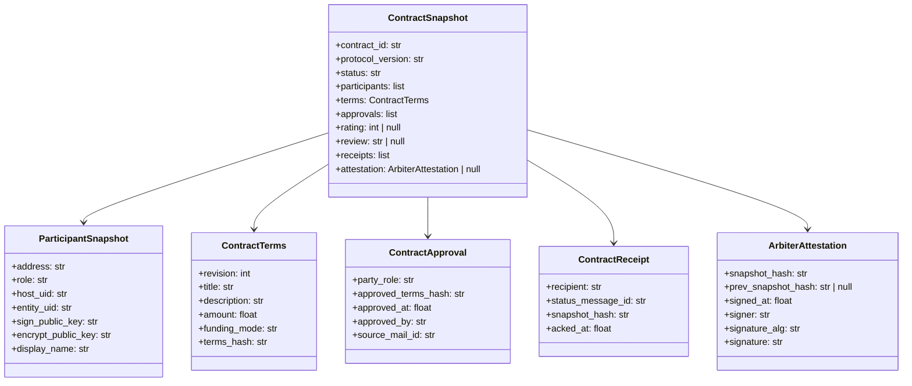
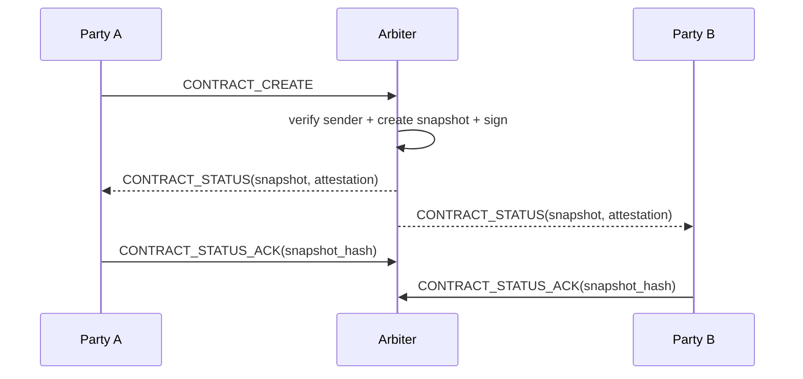

# Trade & Trust 信任协议设计

> 状态：设计草案
>
> 范围：仅覆盖协议层的 trust 数据协议、签名认证、授权、可达确认与安全边界。
>
> 不覆盖：存储实现、Reputation 计算引擎、查询 API、索引与数据库设计。


## 1. 目标

本设计聚焦于 Trade & Trust 中的 **Trust Protocol** 部分，回答以下问题：

- Arbiter 如何对 Contract 快照签名与背书
- Arbiter 如何认证消息发送方身份
- Arbiter 如何判断发送方是否有权限执行某个 Contract 动作
- 协议层如何表达“双方已经收到并确认某个合同状态”
- 如何在不引入额外基建的前提下，复用 FP 现有传输与密码学能力

本设计不试图在当前阶段解决“如何持久化合同链”或“如何计算 credit_score”。
协议层只负责定义可信的数据对象、消息格式和校验规则。


## 2. 设计原则

### 2.1 身份来自传输层，不来自业务 payload

Contract 消息中的操作者身份，必须从已验签的 `Mail.sender` 推导，
而不是信任 payload 内部自报的 `party_role`、`sender` 或 `operator` 字段。

### 2.2 信任来自 Arbiter 对 Contract Snapshot 的签名

Contract 的可信状态不是 Arbiter 内存里的 Python 对象，
而是 Arbiter 对某个 Contract 快照的签名声明。

### 2.3 授权由角色、状态、版本共同决定

一个消息被接受，不仅要求“是正确的人发的”，还要求：

- 对应当前合同参与方
- 对当前状态合法
- 针对当前 revision / terms_hash

### 2.4 协议层只承诺可验证，不承诺完整业务完成

协议层可承诺：

- 消息是否来自某个已知实体
- 某个合同快照是否被 Arbiter 背书
- 某个状态通知是否被参与方确认收到

协议层不承诺：

- 外部支付一定成功
- 网络一定可用
- 对方一定在线


## 3. 协议小白视角：三层 Trust 的区别

Trust 在这里分成三层，它们解决的问题不同：

- 底层传输 trust：保证“这条消息是真的”
- Session trust：保证“这段对话是连续的”
- Contract trust：保证“这次合作的状态链是连续的”

### 3.1 总表

| 维度 | 底层传输 trust | Session trust | Contract trust |
|---|---|---|---|
| 核心目标 | 保证消息真实、未篡改、可保密 | 保证一段对话/会话连续可信 | 保证一次合作/合同生命周期状态可信 |
| 典型对象 | `Mail`、签名、加密 | `session_id`、多轮消息 | `contract_id`、`snapshot`、`Arbiter`、`ACK` |
| 解决的问题 | 谁发的、有没有被改、别人能不能看 | 这条消息是否属于当前对话，上下文是否接得上 | 这一步是否基于当前合法状态，谁有权推进，双方是否对同一状态达成一致 |
| 连续的是什么 | 单条消息的可信传输 | 对话上下文连续 | 合同状态连续 |
| 是否要求对话连续 | 否 | 是 | 否 |
| 是否要求状态连续 | 否 | 弱 | 是 |
| 是否依赖聊天历史 | 否 | 是 | 否 |
| 是否可脱离聊天独立存在 | 是 | 不太行 | 是 |
| 核心校验材料 | `sender / recipient / signature / encryption` | `session_id`、会话上下文 | `contract_id`、`snapshot_hash`、`terms_hash`、状态机、授权 |
| 是否要求版本一致 | 否 | 通常不要求 | 必须要求 |
| 是否要求授权 | 否 | 一般较弱 | 必须明确 |
| 是否要求双方确认看到同一状态 | 否 | 一般不要求 | 经常需要 |
| 适合场景 | 普通消息传输 | 讨论、brainstorm、任务协作 | 报价、接单、交付、验收、评分、结算 |
| 失败后果 | 消息伪造 / 泄露 / 篡改 | 对话错位、上下文混乱 | 状态错乱、责任不清、无法审计 |

### 3.2 为什么 Contract trust 不要求对话连续

`Session trust` 关心的是：

- 这条消息是否接着上一轮对话
- 这段自然语言上下文是否连续

`Contract trust` 关心的是：

- 这一步是否接着当前合同快照
- 当前状态链是否连续

因此，即使聊天窗口断了、换了新会话，只要参与方仍然基于同一个：

- `contract_id`
- `source_snapshot_hash`
- `terms_hash`

发送合法的合同消息，`Contract trust` 仍然成立。

### 3.3 一个直观例子

场景 A：只有 Session trust

- Alice 和 Bob 连续聊了 100 轮
- Bob 说“我同意”
- 这句话可以在对话里理解，但如果上下文断了，就难以判断“同意”的对象

场景 B：有 Contract trust

- Bob 第二天换了一个聊天窗口
- 只发一条 `CONTRACT_APPROVE(contract_id=..., source_snapshot_hash=S3, terms_hash=H3)`
- 虽然对话不连续，但合同状态链仍然连续，因此这一步仍然可信

结论：

- `session trust` 不连续，对话通常就断了
- `contract trust` 不要求对话连续，但要求状态连续

### 3.4 对协作体验的影响

| 问题 | Session trust | Contract trust |
|---|---|---|
| Bob 换了个聊天窗口还能继续吗 | 通常不理想，上下文断了 | 可以，只要基于同一个 `contract_id + snapshot_hash` |
| 前面对话丢了还能推进吗 | 很难 | 可以 |
| 不看聊天记录能验证这一步吗 | 通常不行 | 可以 |
| 更关心“说了什么”还是“状态是什么” | 更关心说了什么 | 更关心状态是什么 |
| 自然语言反复改口会不会出问题 | 可以接受 | 不行，必须显式版本化 |


## 4. 现有 FP 能力复用

当前 FP 已经提供以下可复用能力：

- `Mail` envelope 的签名能力
- Ed25519 签名 / 验签
- X25519 + AES-GCM 加密 / 解密
- `FPAddress` 作为统一地址
- `EntityCard` 作为公钥分发载体
- Host 内部的 mail 路由

因此 Trust Protocol 不新增新的密码学原语，只定义：

- 什么内容需要签名
- 由谁签
- 如何验证
- 什么场景必须加密


## 5. 协议对象

Trust Protocol 建议围绕以下几个核心对象展开。




## 6. 数据对象定义

### 5.1 ParticipantSnapshot

冻结某一方在当前合同上下文中的身份信息。

建议字段：

- `address`
- `role`
  - `party_a`
  - `party_b`
  - `arbiter`
- `host_uid`
- `entity_uid`
- `sign_public_key`
- `encrypt_public_key`
- `display_name`

设计意图：

- 避免事后依赖外部 `EntityCard` 的最新值
- 让第三方只靠 Contract Snapshot 就能拿到验签所需材料


### 5.2 ContractTerms

表示合同条款的可签名最小单元。

建议字段：

- `revision`
- `title`
- `description`
- `amount`
- `funding_mode`
- `terms_hash`

其中：

- `revision` 表示合同条款版本号
- `terms_hash` 为 `canonical_json(terms_without_hash)` 的 SHA256

设计意图：

- 将“批准的是哪一版条款”从状态流中显式表达出来
- 防止使用旧版本合同内容进行批准、拒绝或完成确认


### 5.3 ContractApproval

记录某一参与方对某一版条款的批准事实。

建议字段：

- `party_role`
- `approved_terms_hash`
- `approved_at`
- `approved_by`
- `source_mail_id`

设计意图：

- 批准行为必须绑定具体 `terms_hash`
- 后续 Arbiter 可以验证双方是否批准的是同一版内容


### 5.4 ContractReceipt

表示某方已经收到并确认某个状态快照。

建议字段：

- `recipient`
- `status_message_id`
- `snapshot_hash`
- `acked_at`

设计意图：

- 区分 “Arbiter 已发送状态通知” 和 “参与方已确认收到”
- 为协议层的可达确认提供最小证明


### 5.5 ArbiterAttestation

表示 Arbiter 对当前 Contract Snapshot 的签名背书。

建议字段：

- `snapshot_hash`
- `prev_snapshot_hash`
- `signed_at`
- `signer`
- `signature_alg`
- `signature`

字段说明：

- `snapshot_hash`：当前快照哈希
- `prev_snapshot_hash`：上一状态快照哈希；Genesis 可为 `null`
- `signer`：Arbiter 地址
- `signature_alg`：如 `ed25519-sha256`
- `signature`：Arbiter 对 `snapshot_hash` 的签名结果

设计意图：

- 形成可串联的 Contract Snapshot 链
- 为 Reputation 的后续计算提供可信来源


### 5.6 ContractSnapshot

Contract 的协议级审计快照。

建议字段：

- `contract_id`
- `protocol_version`
- `status`
- `participants`
- `terms`
- `approvals`
- `rating`
- `review`
- `receipts`
- `attestation`

补充说明：

- `rating/review` 仍然保留在快照中，因为它们是信誉协议的原始输入
- `attestation` 在 Arbiter 生成签名前可暂为空，签名后必须存在


## 7. Contract 消息协议

建议保留当前 `CONTRACT_*` 类型，但补充统一的协议字段。

### 6.1 通用字段

所有 Contract 动作消息建议包含：

- `contract_id`
- `expected_status`
- `revision`
- `terms_hash`
- `reason`
- `source_snapshot_hash`

字段含义：

- `expected_status`：发送方认为的当前状态
- `revision`：发送方操作所基于的条款版本
- `terms_hash`：发送方操作所基于的条款哈希
- `source_snapshot_hash`：发送方所观察到的最新快照哈希

设计意图：

- 阻止 stale message
- 阻止旧条款版本上继续操作
- 给 Arbiter 提供并发冲突检测依据

### 6.2 新增消息：`CONTRACT_STATUS_ACK`

建议新增一类消息：

- `CONTRACT_STATUS_ACK`

payload 建议字段：

- `contract_id`
- `snapshot_hash`
- `status_message_id`

语义：

- 接收方确认自己已收到某个由 Arbiter 发送的状态通知

这不是业务同意，不等于 `approve` 或 `accept`，只是“我已看到这个状态快照”。


## 8. 签名与认证

### 7.1 传输层签名

所有 Contract / Pay 消息应使用现有 `Mail.seal()` 进行 envelope 签名。

现有 FP 中：

- envelope 签名算法为 Ed25519
- 消息可选用 X25519 + AES-GCM 加密

Trust Protocol 要求：

- `CONTRACT_*`
- `PAY_*`
- `CONTRACT_STATUS`
- `CONTRACT_STATUS_ACK`

默认都必须经过 envelope 签名。

其中以下消息建议默认加密：

- `CONTRACT_CREATE`
- `CONTRACT_AMEND`
- `CONTRACT_RATE`
- `PAY_COLLECT`
- `PAY_REQUEST`

原因：

- 含有条款内容、评价、支付信息
- 不应作为明文在路由层裸露

### 7.2 Contract Snapshot 签名

Arbiter 对合同快照的签名流程：

1. 构造不带 `attestation.signature` 的标准化 `ContractSnapshot`
2. 对该结构做 canonical JSON 序列化
3. 计算 `snapshot_hash = SHA256(serialized_bytes)`
4. 使用 Arbiter 的 Ed25519 私钥签名 `snapshot_hash`
5. 生成 `ArbiterAttestation`
6. 将 `attestation` 附着到 `ContractSnapshot`

建议公式：

```text
snapshot_hash = SHA256(canonical_json(contract_snapshot_without_attestation_signature))
signature = Ed25519.sign(snapshot_hash, arbiter_private_key)
```

### 7.3 验证流程

任意验证方拿到一个 `ContractSnapshot` 后：

1. 提取 `participants` 中 `role=arbiter` 的公钥
2. 去掉 `attestation.signature`
3. 重新计算 `snapshot_hash`
4. 校验该哈希与 `attestation.snapshot_hash` 一致
5. 用 Arbiter 公钥验证 `attestation.signature`

只有上述 5 步均通过，才认为该快照可信。


## 9. 身份认证

### 8.1 身份来源

Arbiter 不信任业务 payload 中的“操作者自报身份”。
Arbiter 只信任：

- 已验签 envelope 中的 `mail.sender`
- 当前合同中已登记的 `ParticipantSnapshot.address`

即：

```text
authenticated_sender = mail.sender.address
```

而不是：

```text
claimed_sender = payload.sender or payload.party_role
```

### 8.2 Arbiter 必须校验的身份条件

对于所有 `CONTRACT_*` / `PAY_*` 消息，Arbiter 应至少检查：

- `mail.signature` 有效
- `mail.sender` 可映射到当前合同参与方
- `mail.recipient` 指向当前 Arbiter
- 发送方公钥与合同参与方记录一致

如果任一条件失败：

- 拒绝处理
- 返回 `ERROR`
- 不生成新的 Contract Snapshot


## 10. 授权模型

认证回答“你是谁”，授权回答“你能做什么”。

建议授权函数：

```text
authorize(action, sender_address, contract_snapshot) -> allow | deny
```

### 9.1 最小授权矩阵

| Action | 允许角色 | 条件 |
|---|---|---|
| `CONTRACT_CREATE` | `party_a` 或 `party_b` | 合同尚不存在 |
| `CONTRACT_AMEND` | `party_a` 或 `party_b` | 当前状态为 `draft` |
| `CONTRACT_APPROVE` | 双方各自 | `terms_hash` 必须匹配当前条款 |
| `CONTRACT_REJECT` | 双方各自 | 基于当前 revision |
| `CONTRACT_COMPLETE` | 默认 `party_b` | 当前状态为 `active` |
| `CONTRACT_ACCEPT` | 默认 `party_a` | 当前状态为 `completing` |
| `CONTRACT_REWORK` | 默认 `party_a` | 当前状态为 `completing` |
| `CONTRACT_RATE` | 仅 `party_a` | 当前状态为 `settled` 或 `settling` |
| `CONTRACT_CANCEL` | 双方 | 状态机允许 |
| `CONTRACT_DISPUTE` | 双方 | 状态机允许 |
| `PAY_COLLECT` | 收款方 | 与 contract 的 payee 角色一致 |
| `PAY_CONFIRM_RECEIPT` | 收款方 | 与 payment 的 payee 一致 |

### 9.2 授权附加条件

即使角色正确，也必须同时满足：

- `expected_status == current_status`
- `revision == current_terms.revision`
- `terms_hash == current_terms.terms_hash`
- `source_snapshot_hash == current_snapshot_hash`

否则视为：

- 旧状态上的操作
- 旧版本条款上的操作
- 潜在并发冲突


## 11. 可达确认

协议层无法保证网络一定可用，但可以保证：

- Arbiter 是否发出了某个状态
- 某个参与方是否确认已收到该状态

建议状态传播流程如下：



这使协议层区分出三个层级：

- `issued`：Arbiter 已签名并发出状态
- `delivered`：Host 路由层已送达
- `observed`：对方明确 ACK 了这个快照

Trust Protocol 关注的是第三层。


## 12. 安全边界

### 11.1 重放保护

通过以下组合减少 replay 风险：

- `message_id`
- `expected_status`
- `revision`
- `terms_hash`
- `source_snapshot_hash`

任何不匹配当前合同快照的消息均拒绝。

### 11.2 旧版本条款攻击

如果攻击者拿旧版 `approve` 消息重放：

- Arbiter 比对 `revision`
- Arbiter 比对 `terms_hash`
- 不一致则拒绝

### 11.3 冒名发送

如果攻击者伪造 payload 内的 `party_role`：

- Arbiter 不使用 payload 识别操作者
- 只使用已验签 envelope 的 `mail.sender`

### 11.4 中途篡改合同内容

只要 `ContractSnapshot` 已签名：

- 任一字段被改动
- 重新计算的 `snapshot_hash` 就会变化
- 签名验证立即失败

### 11.5 状态通知未被对方看到

只有在收到 `CONTRACT_STATUS_ACK` 后，
协议层才认为对方“已观察到”该状态。


## 13. 错误语义

协议错误和业务动作必须分开。

### 13.1 不应复用 `CONTRACT_REJECT`

`CONTRACT_REJECT` 的业务语义应保持为：

- 合同参与方在 `DRAFT` 阶段对合同条款的真实拒绝

它不应被复用为以下场景的错误反馈：

- `source_snapshot_hash` 不匹配
- `terms_hash` 不匹配
- `expected_status` 不匹配
- 未授权
- Envelope 验签失败

原因：

- 否则接收方无法区分“对方真的拒绝了合同”与“Arbiter 在报告协议校验失败”
- 会把协议错误污染到状态机动作语义里

### 13.2 建议做法

- 传输层校验失败：静默丢弃或记日志
- 语义层校验失败：优先复用通用 `ERROR`
- 如未来需要更细粒度，可新增 `CONTRACT_ERROR`


## 14. 协议层最小实现建议

在不进入存储和计算层的前提下，建议先完成以下最小协议能力：

1. `Mail` 在 Trade/Pay 相关消息上强制启用 envelope 验签
2. 为敏感 Contract/Pay 消息启用默认加密
3. 在 `Contract` 模型中补充：
   - `revision`
   - `terms_hash`
   - `current_snapshot_hash`
   - `participant_snapshots`
   - `approvals`
   - `receipts`
   - `attestation`
4. 新增 `CONTRACT_STATUS_ACK`
5. 将 Arbiter 的签名逻辑落实到每次状态跃迁后
6. 将授权校验抽成独立函数，而不是散落在 handler 中


## 15. 与现有实现的对齐关系

当前代码已具备：

- `Mail` 签名/加密能力
- `Arbiter` 实体
- `CONTRACT_*` / `PAY_*` 消息类型
- 合同状态机
- 最小交易流程

当前代码尚未具备：

- Trade 消息默认启用 envelope 验签
- Trade 消息默认启用加密
- 基于 sender address 的角色认证
- 基于 revision/terms_hash/snapshot_hash 的授权
- Arbiter 对 Contract Snapshot 的签名背书
- `CONTRACT_STATUS_ACK` 的观察确认机制

因此，本设计是对现有 Trade 流程的协议补完，而不是推翻重做。


## 16. 非目标

本设计明确不讨论：

- 合同如何持久化
- Reputation 如何落库
- credit_score 公式
- UI 展示
- 多 Arbiter 竞争治理
- 链上或第三方公证

这些都属于协议之上的实现层问题。


## 17. 总结

Trust Protocol 的核心不是“多几个字段”，而是把以下链条闭合：

- 已认证的消息发送方
- 已授权的合同动作
- 已签名的合同快照
- 已确认的状态通知

只要这四点成立：

- Reputation 以后可以从快照链中计算
- 存储以后可以替换
- API 以后可以追加

但协议层的可信性不会改变。
