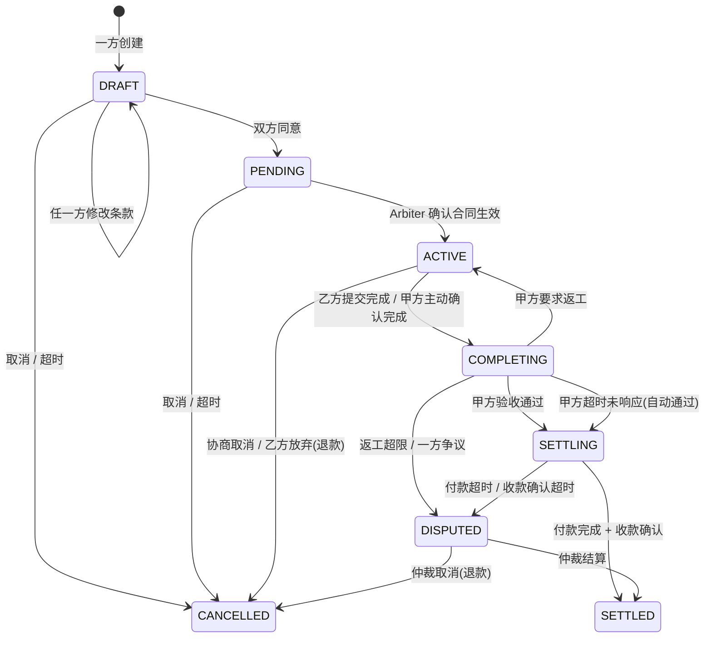
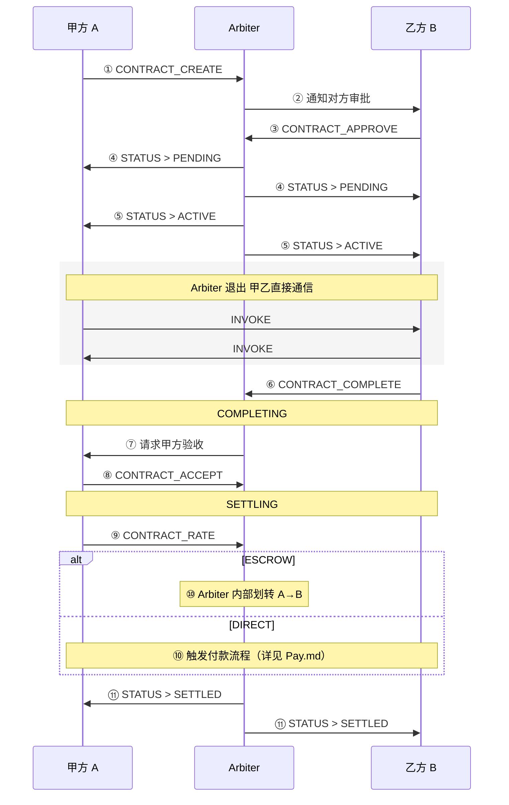
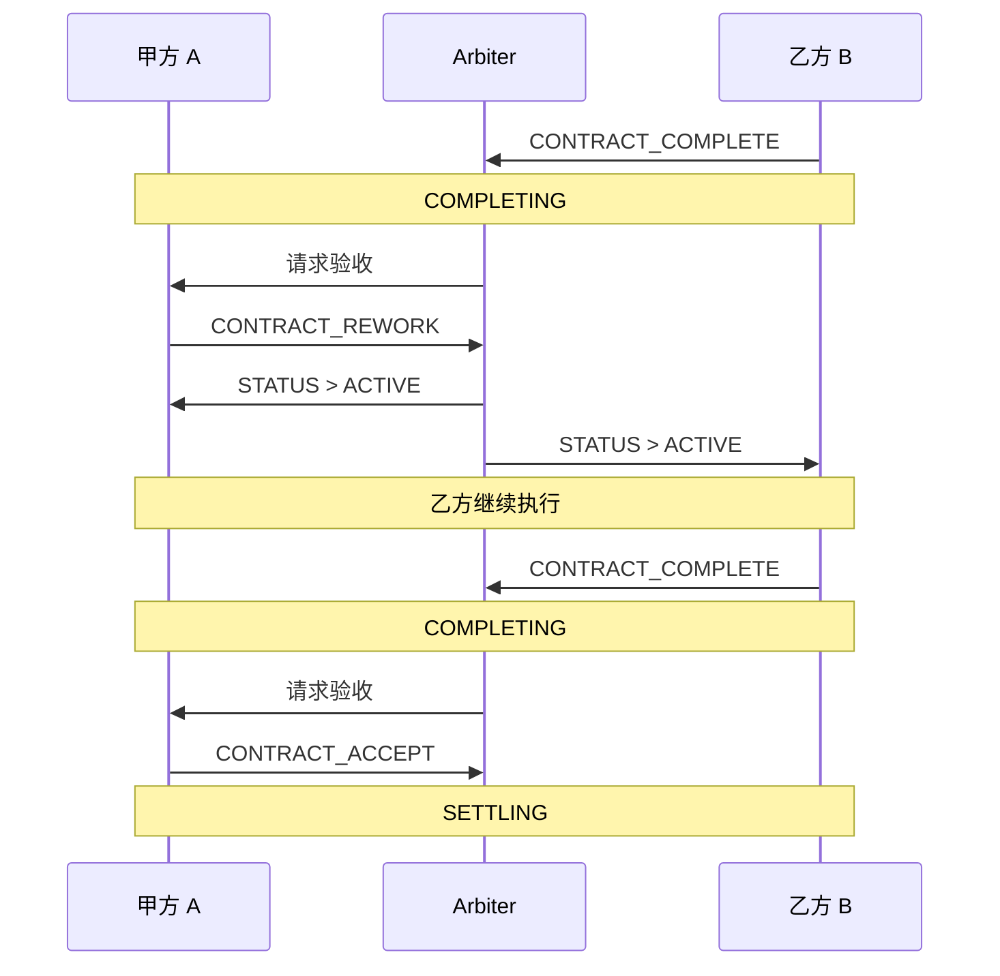

# Trade & Trust 设计文档

> 状态：设计讨论阶段
>
> 本文档记录 Entity 交易能力与信任体系的设计方案。


## 1. 概述

当前 Entity 只有通信能力（mail），缺少交易能力和信任属性。

目标：围绕 **Contract**（合同）构建可追踪、可审计的交易流程，
并通过交易历史积累 Entity 的 **Reputation**（信誉）。

核心三要素：

- **Contract** — 甲乙双方之间的服务合同，是交易的最小审计单元
- **Arbiter** — 仲裁者 Entity，管理合同生命周期、托管资金、执行结算
- **Reputation** — 基于合同历史派生的 Entity 信誉档案


## 2. 核心概念

### 2.1 Arbiter（仲裁者）

一种特殊的 Entity（`EntityKind.ARBITER`），挂载在 Host 上。

**职责边界：**

| 职责 | 说明 |
|------|------|
| 管理合同状态 | Contract 的每次状态变更由 Arbiter 裁决并通知双方 |
| 托管资金 | 甲方付款 → Arbiter 持有 → 结算时打给乙方（两笔独立交易） |
| 校验余额 | 付款前验证甲方余额充足 |
| 维护信誉 | 基于合同历史计算每个 Entity 的 Reputation |
| 通知双方 | 每次状态更新，确保甲乙双方都收到，合同保持一致 |

** 不关心的：**

- 合同执行过程（甲乙之间的业务通信）
- 执行质量（由甲方评分反映）

**设计要点：**

- **Arbiter 的合同管理流程是硬编码的确定性状态机。**
  状态转换规则固定、不可自定义，保证所有参与方对流程有一致预期。
  Arbiter 收到 CONTRACT_* 消息后按固定规则裁决，不存在"策略可配"的空间。
- Arbiter 通过两笔独立交易完成资金流转（甲方→Arbiter，Arbiter→乙方），
  与具体支付方式解耦。
  未来可对接外部支付，Arbiter 只需替换收付款实现。
- Arbiter 是 `EntityKind` 的一种，不是硬编码到 Host 的逻辑，
  可替换、可多实例。
- v0.1 阶段 Arbiter 自行管理虚拟余额（balance），
  每个 Entity 在 Arbiter 处有一个账户。

### 2.2 Contract（合同）

一次服务交易的完整审计单元。

**关键设计决策：**

- 甲方（party_a）= 需求方/付款方
- 乙方（party_b）= 服务方/收款方
- **任意一方都可以创建**，创建时指定甲乙角色，
  另一方同意后合同拟定完成
- Contract 由 Arbiter 统一管理和存储
- 每次状态变更 Arbiter 通知双方，保证三方一致

**不可篡改性：**

- 已结算（SETTLED）的 Contract 不可修改，是永久审计记录
- 每个 Contract 携带 Arbiter 的 **SHA256 签名**，
  任何人可验证合同内容未被篡改
- Entity 的 Reputation 指标完全从已签名的 Contract 列表计算得出，
  不独立存储、不可直接编辑

### 2.3 Entity 侧的合同 CheckPoint（可自定义）

与 Arbiter 硬编码流程相对，**Entity 侧对合同事件的响应是可自定义的**，
通过 CheckPoint 机制实现。

典型场景：

- Entity 收到付费请求（CONTRACT_CREATE 通知）时，
  owner 可能需要人工审批，也可能自动同意
- Entity 收到付款到账通知时，
  owner 可能需要确认才开始执行
- Agent Entity 可能设置自动接受所有合同（免审批）

这些行为**不由 Arbiter 决定，不硬编码**，
而是由 Entity 自身的 CheckPoint 链控制：

```python
# 示例：合同审批 CheckPoint
class ContractApprovalCheckPoint(CheckPoint):
    """收到合同相关消息时，决定是否需要 owner 介入。"""
    # auto_approve=True → 自动同意，无需 owner
    # auto_approve=False → 推送给 owner，等待人工确认
```

设计原则：
- **Arbiter 管流程（硬编码）**：状态怎么转、钱怎么流，Arbiter 说了算
- **Entity 管决策（可自定义）**：要不要接这个合同、要不要确认完成，Entity 自己决定

### 2.4 Reputation（信誉）

从 Contract 历史**派生计算**的 Entity 信誉指标，不独立存储、不可直接编辑。

**计算来源：**

Arbiter 维护的 Contract 列表是唯一数据源。
每个已结算的 Contract 都携带 Arbiter 的 SHA256 签名，不可篡改。
Reputation 指标（平均评分、完成率、信用分）始终从这条签名链实时计算。

**可验证性：**

任何 Entity 都可以请求 Arbiter 提供某个 Entity 的 Contract 历史，
逐一验证 Arbiter 签名后自行计算 Reputation，
无需信任 Arbiter 提供的汇总数据。

**公开展示：**

`EntityCard.metadata` 携带 Reputation 摘要（如 `credit_score`、`avg_rating`），
供发现阶段快速参考。但这只是缓存，真实数据以签名 Contract 链为准。

评分规则：**甲方对乙方单向评分**（合同结算时）。

信誉维度：

- 合同完成率（completed / total）
- 平均评分（作为乙方收到的评分均值）
- 超时次数
- 综合信用分（由以上指标计算）

## 3. Contract 生命周期



合同创建时通过 `funding_mode` 字段选定付款模式：

- **`ESCROW`**：Arbiter 管理虚拟账本。SETTLING 阶段 Arbiter 内部将甲方余额划转给乙方，无需外部支付流程。
- **`DIRECT`**：Arbiter 仅做信任背书。SETTLING 阶段甲方通过外部支付流程直接付款给乙方（详见 Pay.md）。

| 状态 | 含义 | 触发条件 |
|------|------|----------|
| `DRAFT` | 草案 | 一方创建合同，双方可反复修改条款，直到双方都同意 |
| `PENDING` | 待生效 | 双方同意，Arbiter 确认合同条件满足（如 ESCROW 模式校验甲方余额充足） |
| `ACTIVE` | 执行中 | 通知乙方可执行，通知甲方进入执行阶段 |
| `COMPLETING` | 验收中 | 乙方提交完成 / 甲方主动提交完成，等待甲方验收确认 |
| `SETTLING` | 结算中 | 甲方验收通过，进入评分 + 付款流程（ESCROW: Arbiter 内部划转 / DIRECT: 触发外部支付） |
| `SETTLED` | 已结算 | 付款完成 + 收款确认，合同完成 |
| `CANCELLED` | 已取消 | 各阶段的取消/退款（见下文） |
| `DISPUTED` | 争议中 | 一方不同意结果 / DIRECT 模式收款确认超时 |

ESCROW / DIRECT 是两种付款模式

## 4. 交互流程

### 4.1 正常流程



### 4.2 返工流程

乙方提交完成后，甲方认为未达标，可以拒绝并要求返工：



返工次数需要限制（`max_rework_count`），
超过上限后：
- 甲方仍不满意 → 自动进入 DISPUTED
- 防止甲方无限返工拖延乙方


### 4.3 各阶段超时规则（Arbiter 硬编码）

以下超时由 Arbiter 状态机强制执行，不可绕过：

| 阶段 | 超时场景 | Arbiter 处理 |
|------|----------|-------------|
| **DRAFT** | 对方超时未审批 | 自动 CANCELLED |
| **PENDING** | 甲方超时未付款（ESCROW）/ 双方超时未确认（DIRECT） | 自动 CANCELLED |
| **ACTIVE** | 乙方超时未完成 | 自动 CANCELLED + 退款给甲方（ESCROW） |
| **COMPLETING** | 甲方超时未验收 | 自动视为验收通过 → SETTLING |
| **SETTLING** | ESCROW：B 超时未确认收款 | 自动 SETTLED（Arbiter 有支付凭证） |
| **SETTLING** | DIRECT：B 超时未确认收款 | 自动 DISPUTED（Arbiter 无法代为确认） |
| **DISPUTED** | 争议超时未解决 | v0.1 待定 |

超时触发后，拖延方的 Reputation 记录一次超时事件。


### 4.4 各阶段取消规则

| 阶段 | 谁能取消 | 处理 |
|------|---------|------|
| **DRAFT** | 任一方 | 直接 CANCELLED |
| **PENDING** | 任一方 | 直接 CANCELLED |
| **ACTIVE** | 双方协商 | 甲方发起取消 → Arbiter 通知乙方确认 → CANCELLED |
| **ACTIVE** | 乙方单方 | 乙方放弃执行 → CANCELLED → 乙方 Reputation 受损 |
| **COMPLETING** | 不可直接取消 | 只能确认、返工或争议 |
| **SETTLING** | 不可取消 | 支付失败/超时 → DISPUTED |
| **DISPUTED** | Arbiter 裁决 | ESCROW: Arbiter 内部划转退还 / DIRECT: 无资金操作，仅记录 |


### 4.5 争议流程

```
COMPLETING 阶段：
  甲方多次要求返工 → 超过 max_rework_count → 自动 DISPUTED
  或 任一方主动发起 DISPUTE

ACTIVE 阶段：
  甲方要求取消 → 乙方不同意 → DISPUTED

DISPUTED 状态下：
  v0.1: 超时自动按已完成工作量比例结算（待定）
  未来: 可引入第三方仲裁、社区投票等机制
```


### 4.6 边界校验（Arbiter 硬编码拒绝）

以下情况 Arbiter 直接拒绝，不进入流程：

| 场景 | 拒绝原因 |
|------|---------|
| 甲方余额不足 | `CONTRACT_FUND` 时校验余额 < amount |
| 自己和自己签合同 | party_a == party_b |
| amount ≤ 0 | 合同金额必须为正数 |
| 对不存在的 Entity 创建合同 | Arbiter 校验双方地址有效性 |
| 非合同当事人操作 | 只有 party_a / party_b 可以操作自己的合同 |
| 状态不允许的操作 | 如 SETTLED 后再次评分、CANCELLED 后再付款 |


## 5. 消息协议

新增 `MessageKind`：

| MessageKind | 方向 | 说明 |
|-------------|------|------|
| `CONTRACT_CREATE` | 任一方 → Arbiter | 创建合同 |
| `CONTRACT_AMEND` | 任一方 → Arbiter | DRAFT 阶段修改条款，draft_version++ |
| `CONTRACT_APPROVE` | 对方 → Arbiter | 同意合同（当前版本） |
| `CONTRACT_REJECT` | 对方 → Arbiter | 拒绝合同 |
| `CONTRACT_ACTIVATE` | Arbiter → 双方 | 合同生效 |
| `CONTRACT_COMPLETE` | 任一方 → Arbiter | 请求验收 |
| `CONTRACT_ACCEPT` | 甲方 → Arbiter | 验收通过，进入 SETTLING |
| `CONTRACT_REWORK` | 甲方 → Arbiter | 拒绝验收，要求返工 |
| `CONTRACT_RATE` | 甲方 → Arbiter | 评分（SETTLING 阶段） |
| `CONTRACT_SETTLE` | Arbiter → 双方 | 结算完成（Payment COMPLETED 后触发） |
| `CONTRACT_CANCEL` | 任一方 → Arbiter | 取消合同 |
| `CONTRACT_DISPUTE` | 任一方 → Arbiter | 发起争议 |
| `CONTRACT_STATUS` | Arbiter → 双方 | 状态同步通知（每次状态变更） |
| `CONTRACT_TIMEOUT` | Arbiter → 相关方 | 超时通知 |


## 6. 数据模型（fp 层）

### 6.1 Contract

```python
class ContractStatus(str, Enum):
    DRAFT = "draft"
    PENDING = "pending"
    ACTIVE = "active"
    COMPLETING = "completing"
    SETTLING = "settling"
    SETTLED = "settled"
    CANCELLED = "cancelled"
    DISPUTED = "disputed"


class FundingMode(str, Enum):
    ESCROW = "escrow"    # Arbiter 托管资金
    DIRECT = "direct"    # Arbiter 仅信任背书


class Contract(BaseModel):
    contract_id: str
    party_a: FPAddress            # 甲方（需求方/付款方）
    party_b: FPAddress            # 乙方（服务方/收款方）
    creator: FPAddress            # 创建者（甲或乙均可）
    arbiter: FPAddress            # 仲裁方

    title: str
    description: str
    amount: float                 # 合同金额
    funding_mode: FundingMode     # 付款模式

    status: ContractStatus

    # 协商
    draft_version: int = 1        # DRAFT 修改版本号

    # 返工
    rework_count: int = 0         # 已返工次数
    max_rework_count: int = 3     # 最大返工次数

    # 评分
    rating: int | None = None     # 甲方对乙方评分 (1-5)
    review: str | None = None     # 甲方评价

    # 时间线
    created_at: float
    approved_at: float | None = None
    activated_at: float | None = None
    completed_at: float | None = None
    settling_at: float | None = None
    settled_at: float | None = None
    cancelled_at: float | None = None

    # Arbiter 签名（SHA256），确保合同不可篡改
    arbiter_signature: str | None = None
```

### 6.2 Reputation

Reputation 不是独立存储的数据，而是从 Arbiter 签名的 Contract 列表**实时计算的视图**。
以下模型用于传输和展示：

```python
class Reputation(BaseModel):
    """从签名 Contract 链计算的信誉视图，非独立存储"""
    entity_uid: EntityUid
    balance: float = 0.0                # 虚拟余额
    total_contracts: int = 0            # 参与合同总数
    completed_contracts: int = 0        # 完成合同数
    cancelled_contracts: int = 0        # 取消合同数
    timeout_count: int = 0              # 超时未响应次数
    avg_rating_as_provider: float = 0.0 # 作为乙方收到的平均评分
    credit_score: float = 0.0           # 综合信用分
```

### 6.3 消息 Payload

```python
class ContractCreatePayload(BaseModel):
    """创建合同"""
    party_a: FPAddress
    party_b: FPAddress
    title: str
    description: str
    amount: float
    funding_mode: FundingMode

class ContractAmendPayload(BaseModel):
    """DRAFT 阶段修改条款"""
    contract_id: str
    title: str | None = None
    description: str | None = None
    amount: float | None = None
    funding_mode: FundingMode | None = None

class ContractActionPayload(BaseModel):
    """合同动作（approve/reject/fund/complete/accept/cancel/dispute/rework）"""
    contract_id: str
    reason: str | None = None

class ContractRatePayload(BaseModel):
    """合同评分（SETTLING 阶段）"""
    contract_id: str
    rating: int              # 1-5
    review: str | None = None

class ContractStatusPayload(BaseModel):
    """Arbiter 状态通知"""
    contract_id: str
    status: ContractStatus
    contract: Contract       # 完整合同快照，保证双方一致
    message: str | None = None
```


## 7. CLI 动作空间

新增 `aln contract` 命令组：

```
aln contract create     # 创建合同
aln contract list       # 查看合同列表
aln contract show       # 查看合同详情
aln contract amend      # 修改合同条款（DRAFT 阶段）
aln contract approve    # 同意合同
aln contract reject     # 拒绝合同
aln contract complete   # 乙方提交完成
aln contract accept     # 甲方验收通过
aln contract rework     # 甲方要求返工
aln contract rate       # 甲方评分
aln contract cancel     # 取消合同
aln contract dispute    # 发起争议

aln reputation show     # 查看信誉
aln reputation balance  # 查看余额
```


## 8. 分层职责

| 层 | 职责 |
|----|------|
| **fp** | Contract/Reputation 模型定义、ContractStatus、CONTRACT_* MessageKind、Payload 定义 |
| **fp** | ArbiterHandler（处理 CONTRACT_* 消息的 Handler） |
| **fp** | ContractCheckPoint（校验合同相关消息） |
| **app** | Arbiter Entity 注册、Contract 持久化、Reputation 持久化、结算 API |
| **aln/cli** | `aln contract *` 命令实现 |
| **web** | 合同管理 UI、信誉展示 |


## 9. 与现有体系的集成点

- `EntityKind` 新增 `ARBITER`
- `MessageKind` 新增 `CONTRACT_*` 系列
- `Entity` 无需修改结构（Reputation 独立存储在 Arbiter 侧）
- `EntityCard.metadata` 可携带 `credit_score` 供发现时参考
- 现有 `PaymentCheckPoint` 可进化为基于 Contract 的校验
- 新增 Entity 侧 `ContractApprovalCheckPoint`，
  通过 CheckPoint 机制实现 owner 介入（可选，非强制）
- Contract 签名复用 Entity 已有的 Ed25519 密钥体系


## 10. 信任安全：防恶意评分

Arbiter 托管资金的设计已经天然避免了**逃单**问题——
甲方付款后资金在 Arbiter 处冻结，乙方交付后才释放，
任何一方都无法单方面带走资金。

但评分环节仍存在恶意打低分的风险。以下是候选防御方案（待定，不互斥）：

### 方案 A：双向评分

当前设计是甲方单向评乙方，甲方评分权力不受制约。
改为双向互评可形成博弈制衡：
- 甲方评乙方：服务质量
- 乙方评甲方：合作体验（需求清晰度、验收合理性）

恶意打低分的一方，自身也会收到对方的低分，credit_score 一起受损。

### 方案 B：评分权重与信誉挂钩

评分者的 credit_score 越高，其评分权重越大：

```
effective_rating = raw_rating × weight(rater.credit_score)
```

信誉差的 Entity 恶意刷低分，影响很小；
信誉高的 Entity 打分更有公信力。

### 方案 C：合同金额门槛

只有 `amount >= min_ratable_amount` 的合同才产生有效评分。
防止通过大量小额合同刷分攻击。

### 方案 D：统计异常检测

如果某 Entity 的评分模式偏离整体分布（如持续给所有人打 1 分），
Arbiter 可自动降低该 Entity 评分的权重。


## 11. 待定问题

1. **争议处理机制** — v0.1 是人工介入还是超时自动处理？
2. **初始余额** — 新 Entity 注册时默认分配多少 credit？
3. **Reputation 算法** — credit_score 的具体计算公式
4. **多 Arbiter** — 是否支持多个 Arbiter 竞争？Entity 如何选择 Arbiter？
5. **合同模板** — 是否支持预定义合同模板，简化创建流程？
6. **防恶意评分** — 第 10 节中的方案 A/B/C/D 选用哪些组合？
7. **超时参数** — confirm_timeout 和 rate_timeout 分别设多长？超时后默认评分是多少？


## 12. 基础设施映射

所有设计实现围绕现有基础设施展开，不引入新的一级概念：

| Trade & Trust 概念 | 映射到现有基础设施 | 说明 |
|---|---|---|
| **Arbiter** | `EntityKind.ARBITER` | 一种 Entity，拥有合同管理和资金托管能力 |
| **Contract 生命周期消息** | `MessageKind.CONTRACT_*` | 多种 Message kind，走现有 Mail 通道 |
| **Reputation** | `EntityCard.metadata` | Entity Card 上的 Metric 字段，从签名 Contract 链计算 |
| **合同存储** | Arbiter Entity 的本地存储 | 通过 Host 持久化 |
| **合同通信** | Mail + Message | 复用现有消息投递链路 |
| **合同校验** | CheckPoint 机制 | 复用现有 CheckPoint 拦截链 |


## 13. TODO

### 13.1 Contract 核心

| # | 任务 | 负责 | 依赖 | 状态 |
|---|------|------|------|------|
| C1 | fp 层：`ContractStatus`、`FundingMode`、`Contract` 模型定义 | | | |
| C2 | fp 层：`CONTRACT_*` MessageKind 注册 | | C1 | |
| C3 | fp 层：Contract Payload 模型（Create/Amend/Action/Rate/Status） | | C1 | |
| C4 | fp 层：`ContractStateMachine` — 状态转换校验 | | C1 | |
| C5 | fp 层：`ContractCheckPoint` — 合同消息拦截校验 | | C2, C4 | |

### 13.2 Arbiter 实现

| # | 任务 | 负责 | 依赖 | 状态 |
|---|------|------|------|------|
| A1 | `EntityKind.ARBITER` 注册 | | | |
| A2 | `ArbiterHandler` — 处理 CONTRACT_* 消息、驱动状态机 | | C4, C5 | |
| A3 | Arbiter 合同持久化（Contract Store） | | C1 | |
| A4 | Arbiter 超时调度器（定时检查各阶段超时） | | A2, A3 | |
| A5 | Arbiter 签名机制（Contract SHA256 签名） | | A3 | |

### 13.3 Pay（结算）

详见 [Pay.md](Pay.md)，支付是独立于 Contract 的一级协议流程。

### 13.4 Reputation（信誉）

| # | 任务 | 负责 | 依赖 | 状态 |
|---|------|------|------|------|
| R1 | Reputation 计算引擎（从签名 Contract 链实时计算） | | A5 | |
| R2 | `EntityCard.metadata` 信誉摘要写入 | | R1 | |
| R3 | 信誉查询 API（可验证：提供 Contract 历史 + 签名） | | R1, A5 | |

### 13.5 Pricing（定价，平台层）

| # | 任务 | 负责 | 依赖 | 状态 |
|---|------|------|------|------|
| PR1 | 定价模式抽象设计（Debate / UpWork / Service） | | | |
| PR2 | Debate：双方协商出价 → 生成 DRAFT | | C1 | |
| PR3 | UpWork：甲方发布需求+报价 → 乙方接单 → 生成 DRAFT | | C1 | |
| PR4 | Service：乙方挂出服务+定价 → 甲方选择 → 生成 DRAFT | | C1 | |

### 13.6 CLI & UI

| # | 任务 | 负责 | 依赖 | 状态 |
|---|------|------|------|------|
| U1 | `aln contract *` CLI 命令组 | | C2, C3 | |
| U2 | `aln reputation *` CLI 命令组 | | R3 | |
| U3 | Web 合同管理 UI | | U1 | |
| U4 | Web 信誉展示 UI | | U2 | |
