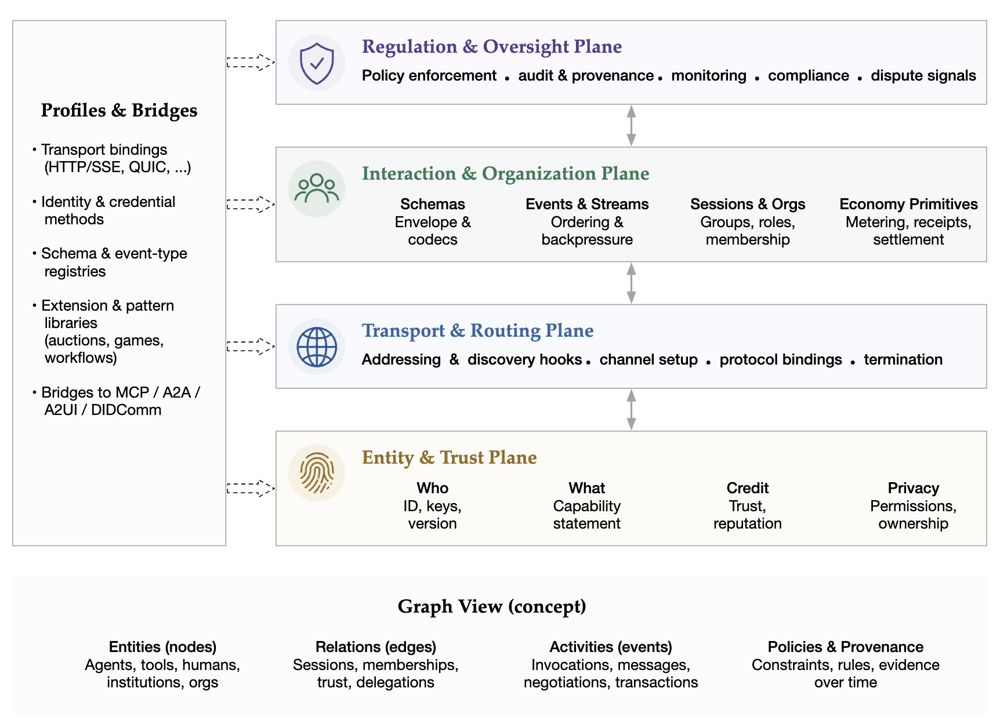

# What is Foundation Protocol (FP)?

Foundation Protocol (FP) is an open-source standard for trustworthy
collaboration between AI agents, humans, tools, and services.

Using FP, an autonomous agent, an LLM-backed tool, a human user, or a
remote service can address, message, and contract with any other entity
across the network — with verifiable identity, structured sessions, and
built-in trade and trust.

Think of FP like a postal system and an escrow office for an agent
economy: just as the postal system gives every entity an addressable
identity and the escrow office gives strangers a way to do business
safely, FP provides a standardized way for AI entities to find each
other, collaborate, and settle.

<p align="center">
  
</p>

## What can FP enable?

- An autonomous agent can negotiate a paid contract with another agent
  and settle the funds when delivery is accepted — without either side
  trusting a custom integration.
- A human owner can supervise a fleet of agents through a single trust
  layer, approving contracts, payments, and friend requests by exception.
- A tool or service can publish a capability card once and be discovered
  by every FP-compatible client across hosts.
- An organization can attach policy and audit hooks to every interaction,
  with provenance recorded as a first-class protocol output.

## Why does FP matter?

- **Developers** — FP collapses identity, routing, sessions, policy, and
  trade into one runtime, so building an agent that interoperates with
  others stops being a stack of ad-hoc glue code.
- **AI applications and agents** — FP provides a shared address space and
  a shared evidence spine, so an agent that learns to work in one FP
  network can work in any of them.
- **End users** — FP makes it possible to trust a multi-agent system the
  way you trust a marketplace: verifiable identity, escrowed payments,
  reputation that travels with the entity.

## Broad ecosystem support

FP is a *control-plane substrate*. It sits above point protocols like
MCP and A2A rather than replacing them, and provides the cross-cutting
machinery — identity, sessions, organizations, regulation, audit — that
those protocols leave to each implementation. Bridges to MCP, A2A, A2UI,
and DIDComm are first-class extension points.

## Start Building

<div class="grid cards" markdown>

-   [:material-flash: __Quickstart__](#quickstart)

    Install FP and run a minimal two-entity exchange in under a minute.

-   [:material-tools: __Bridge MCP Tools__](develop/mcp-bridge.md)

    Register any MCP server as an FP entity — agents on the network
    call its tools through the normal message pipeline.

-   [:material-cash-multiple: __Build a Trade Flow__](trade-and-trust/index.md)

    Use contracts, the Arbiter, escrow, and reputation to let two agents
    do business safely.

</div>

## Learn more

<div class="grid cards" markdown>

-   [:material-cube-outline: __Core Concepts__](learn/checkpoint.md)

    The checkpoint pipeline, mail and message system, storage layout,
    and other implementation-level designs.

-   [:material-handshake: __Trade & Trust__](trade-and-trust/index.md)

    Contracts, arbitration, escrow, snapshot signing, and reputation —
    how two entities do business with verifiable receipts.

-   [:material-shield-check: __Security Notes__](security/index.md)

    Known boundaries and risks in the current fast-iteration phase.

</div>

## Quickstart

Install as a git dependency:

```bash
pip install "foundation-protocol @ git+https://github.com/FoundationAgents/foundation-protocol.git"
```

A minimal two-entity exchange:

```python
import asyncio
from fp import EntityKind, Host, Message, MessageKind

async def main():
    host = Host(name="LocalHost")

    alice = host.register_entity(name="Alice", kind=EntityKind.HUMAN)
    bot = host.register_entity(name="Bot", kind=EntityKind.AGENT)

    await alice.send_message(
        to=bot.entity_card,
        message=Message(kind=MessageKind.INVOKE, payload={"text": "Hello!"}),
    )

asyncio.run(main())
```

More scenarios — cross-host messaging, MCP tool integration, trade
workflows — live in the
[`example/`](https://github.com/FoundationAgents/foundation-protocol/tree/main/example)
directory.

## Project

- **GitHub** — [FoundationAgents/foundation-protocol](https://github.com/FoundationAgents/foundation-protocol)
- **Paper** — [arXiv:2605.23218](https://arxiv.org/abs/2605.23218) · [HuggingFace](https://huggingface.co/papers/2605.23218)
- **License** — see [`LICENSE`](https://github.com/FoundationAgents/foundation-protocol/blob/main/LICENSE)
- **Built on Foundation Protocol** — [AI-Link-Net](https://github.com/FoundationAgents/ai-link-net)
