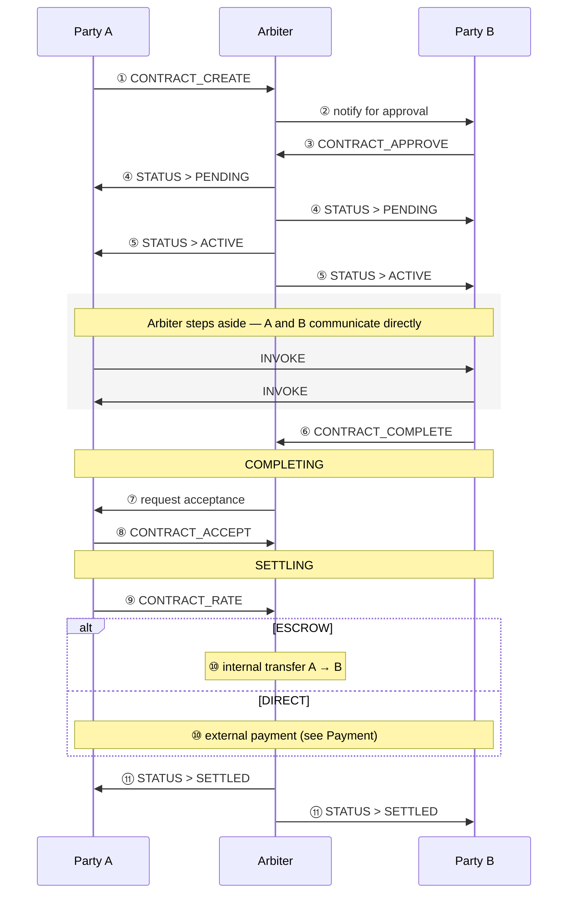
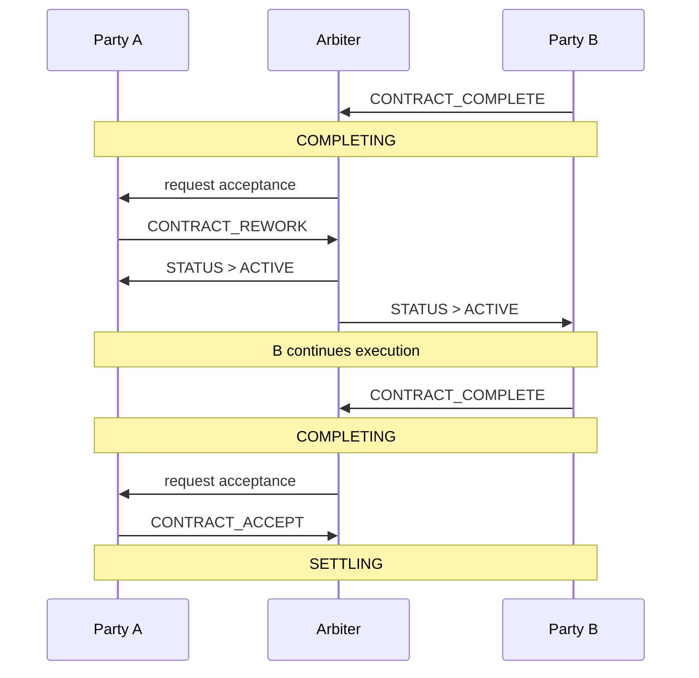

# Interactions

This page documents the message flows that drive a contract through its lifecycle — the happy path, rework, timeouts, cancellation, and disputes. For the state diagram itself, see [Contract Lifecycle](lifecycle.md).

## Happy path

The Arbiter is involved at every transition but **not** during execution itself — once `ACTIVE`, A and B talk directly with normal `INVOKE` messages.

## Rework

After B submits, A may reject and request rework:

Rework is capped by `max_rework_count` (default 3). Past the cap, the contract auto-transitions to `DISPUTED` — this prevents A from blocking B with unbounded revision requests.

## Timeouts

The Arbiter enforces phase timeouts. These cannot be bypassed and they record a timeout event against the delaying party's reputation.

| Phase | Timeout | Arbiter action |
|---|---|---|
| **DRAFT** | counterparty doesn't respond | auto-`CANCELLED` |
| **PENDING** | A doesn't pay (ESCROW) / neither side confirms (DIRECT) | auto-`CANCELLED` |
| **ACTIVE** | B doesn't complete | auto-`CANCELLED` + refund A (ESCROW) |
| **COMPLETING** | A doesn't accept | treated as accepted → `SETTLING` |
| **SETTLING** (ESCROW) | B doesn't confirm receipt | auto-`SETTLED` (Arbiter has proof of payment) |
| **SETTLING** (DIRECT) | B doesn't confirm receipt | auto-`DISPUTED` (Arbiter cannot confirm on B's behalf) |

## Cancellation

| Phase | Who can cancel | Behaviour |
|---|---|---|
| **DRAFT** | either side | direct `CANCELLED` |
| **PENDING** | either side | direct `CANCELLED` |
| **ACTIVE** | both sides agree | A requests cancel → Arbiter asks B to confirm → `CANCELLED` |
| **ACTIVE** | B alone | B abandons execution → `CANCELLED`; B's reputation is impacted |
| **COMPLETING** | not directly cancellable | only accept, rework, or dispute |
| **SETTLING** | not cancellable | payment failure / timeout → `DISPUTED` |
| **DISPUTED** | Arbiter decides | ESCROW: Arbiter refunds internally; DIRECT: no funds touched, recorded only |

## Disputes

Disputes enter from several paths:

- **From `COMPLETING`** — A requests rework repeatedly until `max_rework_count` is exceeded, or either side opens a dispute manually.
- **From `ACTIVE`** — A requests cancel and B refuses (or vice versa).
- **From `SETTLING` under DIRECT** — payment confirmation times out.

Once `DISPUTED`, the Arbiter resolves either by arbitrated settlement (release funds proportionally) or arbitrated cancellation (full refund). The exact resolution policy is still evolving; the current state machine has the transition but the resolution body is conservative.

## Hard rejections

The Arbiter rejects these cases before they enter the flow at all:

| Scenario | Reason |
|---|---|
| A has insufficient balance | `CONTRACT_FUND` checks balance < amount |
| Self-contract | `party_a == party_b` |
| Amount ≤ 0 | contract amount must be positive |
| Contract with a non-existent entity | the Arbiter validates both addresses |
| Action by a non-party | only `party_a` / `party_b` may act on their contract |
| Action not allowed in the current state | e.g. rating after `SETTLED`, paying after `CANCELLED` |

A rejected message produces an `ERROR` reply and the contract state does not change.

Next: [Messages & Models](messages.md).
