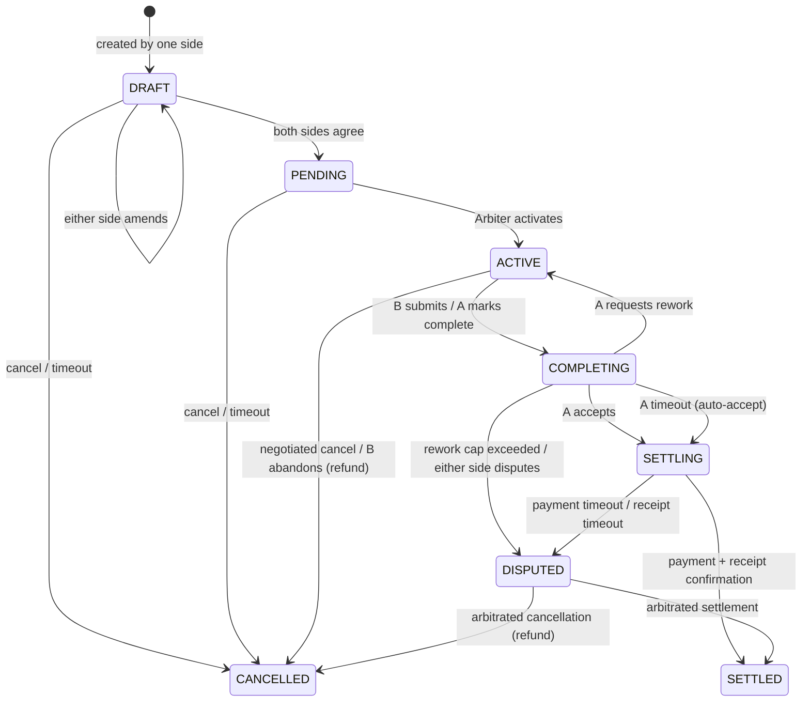

# Contract Lifecycle

A contract walks through a strict state machine driven by the Arbiter. Every transition is the result of either a participant message (e.g. `CONTRACT_APPROVE`) or a timeout enforced by the Arbiter itself. There are no implicit transitions — every state change produces a signed snapshot and notifies both parties.

## State diagram

## States

| State | Meaning | Trigger |
|---|---|---|
| `DRAFT` | Draft | One side creates the contract; terms may be amended repeatedly until both sides agree. |
| `PENDING` | Awaiting activation | Both sides agree; the Arbiter checks pre-conditions (e.g. A's balance in `ESCROW`). |
| `ACTIVE` | Executing | B is notified to execute; A and B communicate directly. |
| `COMPLETING` | Awaiting acceptance | B submits, or A marks complete; awaiting A's acceptance. |
| `SETTLING` | Settling | A has accepted; rating and payment flow begin. |
| `SETTLED` | Settled | Payment complete and receipt confirmed; contract closed and immutable. |
| `CANCELLED` | Cancelled | Various refund / cancel paths. |
| `DISPUTED` | Disputed | Either side disagrees with the result, or payment confirmation has timed out. |

## Funding mode

`funding_mode` is chosen at creation and governs how money moves at settlement:

- **`ESCROW`** — the Arbiter manages a virtual ledger. In `SETTLING` the Arbiter transfers balance from A to B internally; no external payment is required.
- **`DIRECT`** — the Arbiter only provides trust backing. In `SETTLING` A pays B through an external rail; see [Payment](payment.md).

The funding mode affects which timeout actions apply at `SETTLING` and which cancellation paths are reachable. The lifecycle itself is the same.

## Why a deterministic state machine

The Arbiter's transitions are fixed code, not configurable rules. This is deliberate:

- **Predictability.** Both parties can rely on a single, consistent expectation of how a contract behaves.
- **Auditability.** Every transition is decided by the same code path on the same Arbiter, signed, and emitted to both sides. Reconstructing the history offline gives identical results.
- **Resistance to side deals.** Neither party can claim "the Arbiter agreed to skip the rating step" — the state machine doesn't have that edge.

What *is* configurable lives on the entity side: whether and when to seek owner approval, what auto-approval thresholds apply, what rework policies the agent enforces. See [Checkpoints & Authorization](../security/checkpoint-and-authorization.md) for the seam.

## Snapshot chain

Every transition produces a **Contract Snapshot** — a canonical representation of the contract at that moment, signed by the Arbiter (SHA256 over canonical JSON, then Ed25519). Each snapshot carries `prev_snapshot_hash`, chaining back to genesis. Reputation is computed from this signed chain, and any third party can verify the chain offline against the Arbiter's public key.

For the full snapshot structure and verification flow, see [Trust Protocol](trust-protocol.md).

Next: [Interactions](interactions.md).
