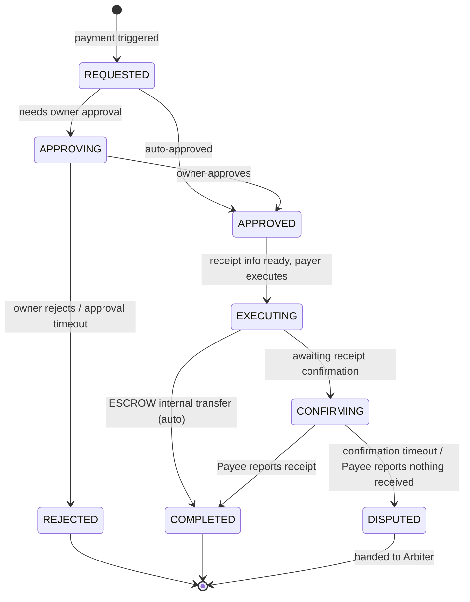

# Payment

Payment (`Pay`) is the protocol flow for transferring value between entities. A contract entering `SETTLING` triggers a payment, but payment itself has its own state machine, message family, and approval pipeline — it is **not** a sub-state of the contract.

Two design choices shape everything else:

- **Decoupled from contracts.** A contract says "now is the time to pay"; *how* the payment happens and *who* executes it belongs to Pay.
- **Decoupled from any specific payment provider.** The protocol layer defines `PaymentRequest` and `PaymentProof` only — concrete rails (QR code, bank transfer, crypto, third-party gateway) live above the protocol.

## Payment modes

### ESCROW — Arbiter-internal transfer

The Arbiter manages a virtual ledger. Each entity has an account at the Arbiter. At `SETTLING` the Arbiter performs the internal transfer A→B; no external payment is involved.

- No external rail required — a ledger operation completes the payment.
- The Arbiter freezes A's funds at activation, so the balance is guaranteed at settlement.
- Settlement is automatic; B does not need to manually confirm receipt.

### DIRECT — external rail

A pays B through an external mechanism. The Arbiter provides trust backing and flow coordination only; it does not touch the money.

The payment rail is chosen by the payee (or negotiated). The protocol layer abstracts each rail uniformly: **the payee provides receipt information; the payer executes; the payee senses arrival and reports it.**

| Rail | Protocol-layer behaviour |
|---|---|
| Receipt QR code | Payee sends QR data to Payer |
| Payment link | Payee sends the payment URL |
| Bank transfer | Payee sends account info; Payer transfers offline and submits proof |
| Cryptocurrency | Payee sends wallet address; Payer transfers and submits the tx hash |
| Third-party gateway | Gateway returns a token / callback |

> Sensing receipt is the **payee's** responsibility. Whatever platform the payee uses to receive funds is what tells them payment has arrived. The protocol does not care *how* the payee knows — only whether the payee reports it.

## The four-party model

The classical four-party model adapted for entity communication:

```text
┌──────────┐                          ┌──────────┐
│  Payer   │  ←── PAY_COLLECT ──→     │  Payee   │
│ (Entity) │     (receipt info)       │ (Entity) │
└────┬─────┘                          └────┬─────┘
     │                                     │
     │  external                           │  senses
     │  payment                            │  receipt
     │                                     │
     ▼                                     ▼
┌──────────┐                          ┌──────────┐
│ Payer's  │  ←── settlement ──→      │ Payee's  │
│ bank /   │     (off-protocol)       │ bank /   │
│ wallet   │                          │ wallet   │
└──────────┘                          └──────────┘
```

**The protocol covers only the upper half**: payee initiates collection → payer executes externally → payee senses arrival → payee reports the result. The lower half (settlement between financial institutions) is off-protocol.

The flow is **payee-driven**. Even when the payer initiates payment intent, the payee triggers the collection flow; receipt information is provided at payment creation, so there is no "waiting for receipt info" intermediate state.

## Approval

Every payment goes through an approval phase before execution. The approval policy lives in the **payer's** checkpoint pipeline, not the Arbiter — different entities may have wildly different approval rules.

```text
PaymentApprovalCheckPoint:
    receives PAY_REQUEST →
    evaluates auto-approval rules →
    auto-approve OR escalate to Owner
```

Configurable auto-approval conditions:

| Condition | Example |
|---|---|
| Amount threshold | `amount <= 100` |
| Whitelisted counterparty | specific Entities auto-approved |
| Daily cumulative limit | under X in the last 24h |

If no rule matches, the request is pushed to the owner (via the [Carbon Copy](../learn/carbon-copy.md) channel):

- Owner approves → continue payment
- Owner rejects → payment fails → notify Arbiter
- Owner times out → policy decides (default reject)

After approval, the actual execution depends on the **pay mode**:

| Mode | Behaviour |
|---|---|
| `ENTITY_PAY` | Entity pays itself — virtual ledger transfer or API call to a payment gateway. Owner only approves. |
| `OWNER_PAY` | Owner pays personally — manually scans the QR code or follows the link. |

`ESCROW` is always `ENTITY_PAY`. `DIRECT` depends on the entity's capabilities — gateway-integrated entities use `ENTITY_PAY`; otherwise `OWNER_PAY`.

## State machine



## Message kinds

| MessageKind | Direction | Purpose |
|---|---|---|
| `PAY_COLLECT` | Payee → Payer | initiate collection (carries receipt info) |
| `PAY_REQUEST` | Arbiter → Payer | payment request triggered by `SETTLING` |
| `PAY_APPROVE` | Owner → Entity | approval |
| `PAY_REJECT` | Owner → Entity | rejection |
| `PAY_CONFIRM_RECEIPT` | Payee → Arbiter | Payee reports receipt |
| `PAY_CLAIM_COMPLETED` | Payer → Arbiter | Payer claims payment completed |
| `PAY_COMPLETED` | Arbiter → both | payment completed |
| `PAY_FAILED` | Entity → Arbiter | payment failed |
| `PAY_TIMEOUT` | Arbiter → affected party | timeout notification |

## Data models

```python
class PaymentStatus(str, Enum):
    REQUESTED = "requested"
    APPROVING = "approving"
    APPROVED = "approved"
    REJECTED = "rejected"
    EXECUTING = "executing"
    CONFIRMING = "confirming"
    COMPLETED = "completed"
    DISPUTED = "disputed"


class PaymentMethod(str, Enum):
    ESCROW = "escrow"          # Arbiter-internal transfer
    QR_CODE = "qr_code"
    PAY_LINK = "pay_link"
    BANK = "bank"
    CRYPTO = "crypto"
    GATEWAY = "gateway"


class PayMode(str, Enum):
    ENTITY_PAY = "entity_pay"
    OWNER_PAY = "owner_pay"


class Payment(BaseModel):
    payment_id: str
    contract_id: str | None = None   # related Contract (optional — supports stand-alone payments)
    payer: FPAddress
    payee: FPAddress
    amount: float

    method: PaymentMethod
    pay_mode: PayMode
    status: PaymentStatus = PaymentStatus.REQUESTED

    # Receipt info (provided by Payee at collection time)
    receipt_info: str

    # Timeline
    requested_at: float
    approved_at: float | None = None
    executed_at: float | None = None
    completed_at: float | None = None


class ApprovalRule(BaseModel):
    """One auto-approval rule. All conditions on the rule must hold;
    multiple rules are OR-combined in PaymentApprovalPolicy."""
    max_amount: float | None = None
    whitelist: list[str] | None = None       # FPAddress strings or entity_uid
    daily_limit: float | None = None


class PaymentApprovalPolicy(BaseModel):
    auto_approve_rules: list[ApprovalRule] = []
    default_action: str = "reject"       # when no rule matches
    timeout_seconds: int = 3600
    timeout_action: str = "reject"
```

## Message payloads

```python
class PayCollectPayload(BaseModel):
    """Payee initiates collection (carries receipt info)."""
    payment_id: str                         # generated client-side
    contract_id: str | None = None
    payer: FPAddress
    payee: FPAddress
    amount: float
    method: PaymentMethod
    receipt_info: str


class PayRequestPayload(BaseModel):
    """Arbiter triggers payment request when a contract enters SETTLING."""
    payment_id: str
    contract_id: str
    payee: FPAddress
    amount: float
    method: PaymentMethod
    receipt_info: str


class PayActionPayload(BaseModel):
    """Generic payment action (approve / reject / confirm_receipt /
    claim_completed). Carries the latest Payment snapshot when the
    action mutates payment state."""
    payment_id: str
    reason: str | None = None
    payment: Payment | None = None


class PayStatusPayload(BaseModel):
    """Payment status notification (completed / failed / timeout)."""
    payment_id: str
    status: PaymentStatus
    payment: Payment
    message: str | None = None
```

## Interaction with contracts

When a contract enters `SETTLING`:

```text
SETTLING
    │
    ├── ESCROW
    │     Arbiter creates Payment(method=ESCROW, pay_mode=ENTITY_PAY)
    │     Arbiter performs internal transfer → Payment COMPLETED
    │     → Contract SETTLED
    │
    └── DIRECT
          Payee provides receipt info → Arbiter creates Payment
          Arbiter sends PAY_REQUEST → Payer (with receipt info)
          → approval → external execution → Payee senses receipt → reports
          Payment COMPLETED → Contract SETTLED
          Payment DISPUTED / REJECTED / timeout → Contract DISPUTED
```

The contract layer only cares about two outcomes:

- `Payment COMPLETED` → continue to `SETTLED`
- `Payment` fails / times out / disputed → `Contract DISPUTED`

Everything between is the payment subsystem's concern.

Next: [Trust Protocol](trust-protocol.md).
