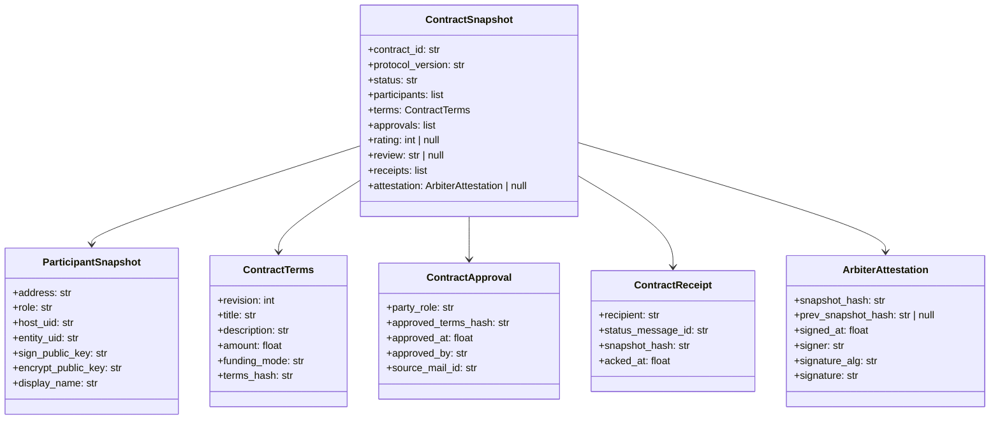
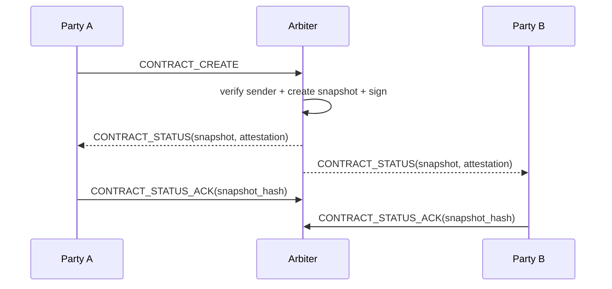

# Trust Protocol

The Trust Protocol is the cryptographic and authorisation layer underneath the contract state machine. The state machine answers *what state we are in*; Trust answers *can we trust that state*.

The protocol layer makes a deliberately narrow set of promises:

- a message is from a known entity (signature verification)
- a contract snapshot is endorsed by the Arbiter (snapshot signature)
- a state notification has been observed by a participant (status ACK)

It deliberately does **not** promise that external payments succeed, that the network is available, or that a counterparty is online.

## Trust at three layers

Trust is not one thing. It is three layers that solve different problems.

| Dimension | Transport trust | Session trust | Contract trust |
|---|---|---|---|
| Goal | Message is authentic, untampered, optionally confidential | A conversation is continuous and coherent | A collaboration's state chain is consistent |
| Carried by | `Mail` signature, optional encryption | `session_id`, multi-turn message thread | `contract_id`, signed `Contract Snapshot`, Arbiter attestation, ACK |
| Continuity requirement | None | Conversation continuity | State continuity |
| Survives a new chat window | Trivially | Often not | Yes — only `contract_id` + `snapshot_hash` are required |
| Failure mode | Forgery, leakage, tampering | Context drift, confused replies | State desync, broken audit chain |

Contract trust does **not** require conversation continuity — even if the chat window is lost and a new session is started, a contract action carrying the right `contract_id`, `source_snapshot_hash`, and `terms_hash` is still verifiable.

## Reusing existing FP capabilities

Foundation Protocol already provides:

- `Mail` envelope signing (Ed25519)
- Optional `X25519 + AES-GCM` encryption
- `FPAddress` as the canonical address
- `EntityCard` as the public-key carrier
- In-host mail routing

Trust Protocol does **not** introduce new cryptographic primitives. It defines:

- what content must be signed
- by whom
- how it is verified
- when encryption is mandatory

## Protocol objects



### ParticipantSnapshot

Freezes a participant's identity in the context of one contract: `address`, `role` (`party_a` / `party_b` / `arbiter`), `host_uid`, `entity_uid`, `sign_public_key`, `encrypt_public_key`, `display_name`.

Snapshotting identity at contract time means third parties can verify the chain without depending on the *current* `EntityCard` — they only need what is in the snapshot.

### ContractTerms

The smallest signable unit of contract terms: `revision`, `title`, `description`, `amount`, `funding_mode`, `terms_hash` (SHA256 over canonical JSON of the terms minus the hash).

`revision` lets the Arbiter distinguish *which version of the terms* a participant is approving, and prevents stale-version replay.

### ContractApproval

Records one party's approval of a specific `terms_hash`. Lets the Arbiter prove both sides approved the **same** version of the terms.

### ContractReceipt

Distinguishes "Arbiter has sent a state notification" from "the participant has acknowledged the snapshot". Required for the issued / delivered / observed distinction described below.

### ArbiterAttestation

The Arbiter's signature on a Contract Snapshot, with `prev_snapshot_hash` chaining each snapshot to the previous one. This forms the signed chain reputation is computed from.

### ContractSnapshot

The full protocol-level audit record for one moment in a contract's life.

## Snapshot signing

The Arbiter's signing procedure on each state transition:

```text
1. Build a ContractSnapshot without the signature field
2. Canonical JSON serialisation
3. snapshot_hash = SHA256(serialised_bytes)
4. signature    = Ed25519.sign(snapshot_hash, arbiter_private_key)
5. Populate the ArbiterAttestation
6. Attach the attestation to the snapshot
```

Any verifier given a snapshot:

```text
1. Extract the Arbiter's public key from the snapshot's participants
2. Strip the signature
3. Recompute snapshot_hash
4. Check it matches attestation.snapshot_hash
5. Verify attestation.signature with the Arbiter's public key
```

Only if all five steps pass is the snapshot considered authentic.

## Authentication

The Arbiter does **not** trust an operator identity self-reported in the payload. It trusts:

- the already-verified `mail.sender` from the envelope
- the `ParticipantSnapshot.address` registered for the current contract

That is:

```text
authenticated_sender = mail.sender.address
NOT
claimed_sender = payload.sender or payload.party_role
```

For every `CONTRACT_*` / `PAY_*` message the Arbiter checks at minimum:

- `mail.signature` is valid
- `mail.sender` maps to a participant on this contract
- `mail.recipient` is this Arbiter
- the sender's public key matches the participant record

If any of these fails the message is rejected, an `ERROR` is returned, and no new snapshot is produced.

## Authorisation

Authorisation answers *can this authenticated party perform this action right now?* The authorisation function takes the action, the authenticated sender address, and the current snapshot:

```text
authorize(action, sender_address, contract_snapshot) -> allow | deny
```

| Action | Allowed roles | Conditions |
|---|---|---|
| `CONTRACT_CREATE` | `party_a` or `party_b` | contract does not yet exist |
| `CONTRACT_AMEND` | either party | status is `draft` |
| `CONTRACT_APPROVE` | either party | `terms_hash` matches the current terms |
| `CONTRACT_REJECT` | either party | based on the current revision |
| `CONTRACT_COMPLETE` | default `party_b` | status is `active` |
| `CONTRACT_ACCEPT` | default `party_a` | status is `completing` |
| `CONTRACT_REWORK` | default `party_a` | status is `completing` |
| `CONTRACT_RATE` | only `party_a` | status is `settled` or `settling` |
| `CONTRACT_CANCEL` | either party | state machine allows it |
| `CONTRACT_DISPUTE` | either party | state machine allows it |
| `PAY_COLLECT` | payee | matches the contract's payee role |
| `PAY_CONFIRM_RECEIPT` | payee | matches the payment's payee |

Beyond the role check, the request must also satisfy:

- `expected_status == current_status`
- `revision == current_terms.revision`
- `terms_hash == current_terms.terms_hash`
- `source_snapshot_hash == current_snapshot_hash`

Otherwise the message is acting on stale state and is rejected.

## Reachability — issued, delivered, observed

The protocol cannot guarantee a delivered network. It can guarantee three explicit levels of confidence:

- **issued** — the Arbiter has signed and emitted a state
- **delivered** — the host layer has routed it
- **observed** — the recipient has explicitly ACK'd the snapshot

`CONTRACT_STATUS_ACK` is the message that distinguishes observed from merely delivered:



Trust Protocol guarantees apply at the *observed* layer, not the delivered layer.

## Envelope and encryption policy

All `CONTRACT_*`, `PAY_*`, `CONTRACT_STATUS`, and `CONTRACT_STATUS_ACK` messages **must** be envelope-signed via `Mail.seal()`.

The following messages **should** default to encryption (X25519 + AES-GCM), because they carry contract terms, ratings, or payment information that should not travel as plaintext through routers:

- `CONTRACT_CREATE`
- `CONTRACT_AMEND`
- `CONTRACT_RATE`
- `PAY_COLLECT`
- `PAY_REQUEST`

## Threat coverage

| Threat | Defence |
|---|---|
| Replay of an old approve | Arbiter compares `revision` and `terms_hash` against current state |
| Spoofed `party_role` | Arbiter ignores payload identity; uses verified `mail.sender` |
| Mid-flight tampering | Any field change shifts `snapshot_hash`; signature verification fails |
| Lost state notification | The recipient ACK in `CONTRACT_STATUS_ACK` distinguishes delivered from observed |

## Error semantics

Protocol errors must be kept separate from business-action semantics.

`CONTRACT_REJECT` is reserved for the business meaning "I refuse this contract in `DRAFT`". It must **not** be used to report protocol-level errors (mismatched `source_snapshot_hash`, mismatched `terms_hash`, mismatched `expected_status`, failed signature verification, authorisation failure). Recommended handling:

- Transport-layer failure → silently drop or log
- Semantic-layer failure → reuse the generic `ERROR` message kind
- If finer granularity is needed later, introduce `CONTRACT_ERROR`

This separation prevents protocol noise from polluting state-machine semantics.

## Summary

Trust Protocol closes the chain:

- **authenticated** message sender
- **authorised** contract action
- **signed** Contract Snapshot
- **observed** state notification

When those four hold, reputation can be derived from the snapshot chain offline, storage can be replaced, APIs can evolve — but the trust property of the protocol does not change.

Next: [Reputation](reputation.md).
